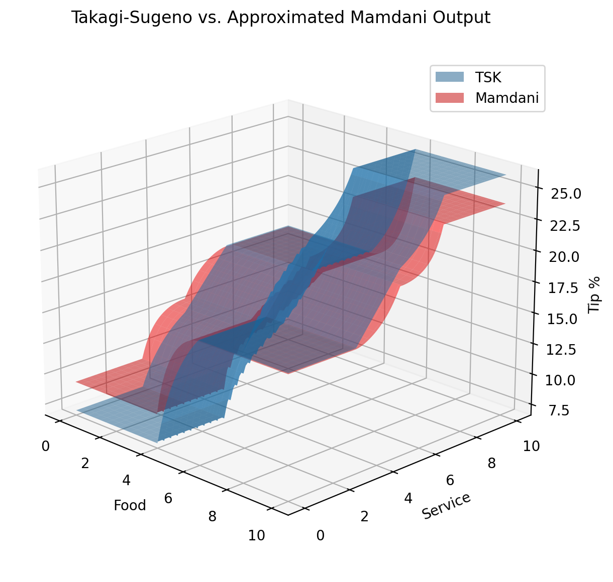

Guide: Approximation
====================

**Experimental!**

With some error, membership functions used as outputs in Mamdani inference
can be reinterpreted as singleton zeroth-order Takagi-Sugeno outputs and
vice versa.

This theoretically allows the explainability of Mamdani inference and
the computational efficiency of Takagi-Sugeno inference with the same functions.

Mamdani to Takagi-Sugeno
------------------------

Upon creation, a FuzzyFunc stores a value as the 'center' depending on the type
of membership. This value is used in Takagi-Sugeno evaluation even if the
function is fully-defined.

Linear templates and custom functions save the average of parameters
corresponding to the highest membership. For example, the 'center' of a
trapezoidal function would be the input corresponding to the midpoint
between the second and third parameter.

Special functions with unique callables simply use the first parameter as the
'center' point. If this is unhelpful, the desired center point can be passed
as an additional first parameter even if it is not used by the callable.

The 'center' value is also an attribute that can be set manually after
creation.

.. code-block:: python

    # Assuming fis consequent membership functions are not explicitly 'tsk'
    tsk_output = fis.eval_tsk(inputs)

Takagi-Sugeno to Mamdani
------------------------

In a method similar to that described by Madina [5], triangular Mamdani
membership functions can be approximated given a ruleset and supported
antecedent functions.

For a single antecedent A and consequent B, an approximated B is created by
calculating the average TSK output given A's left and center parameters, center
parameter, and then center and right parameters. These three values are then
sorted and used as the left, center, and right of a triangular output function.
This is repeated for each rule in the ruleset. If multiple rules have the same
consequent, the final parameters are averaged.

For multiple antecedents, the ruleset is evaluated using TSK as before, but
for each combination left/center, center, and center/right combos of input
parameters. If a rule does not address all antecedent groups in the ruleset,
combinations of input are as described above for those which are present and
include left, center, and right if not.

The supported input functions for approximation are triangular, trapezoidal,
leftedge, and rightedge.

Example:

.. code-block:: python

    approx_fis = fis.approximate_mamdani()
    mamdani_output = approx_fis.eval_mamdani(inputs)

Prototype results with tipping example:

