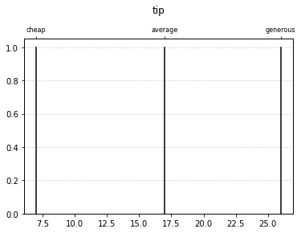
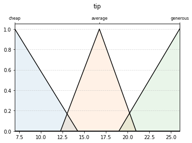
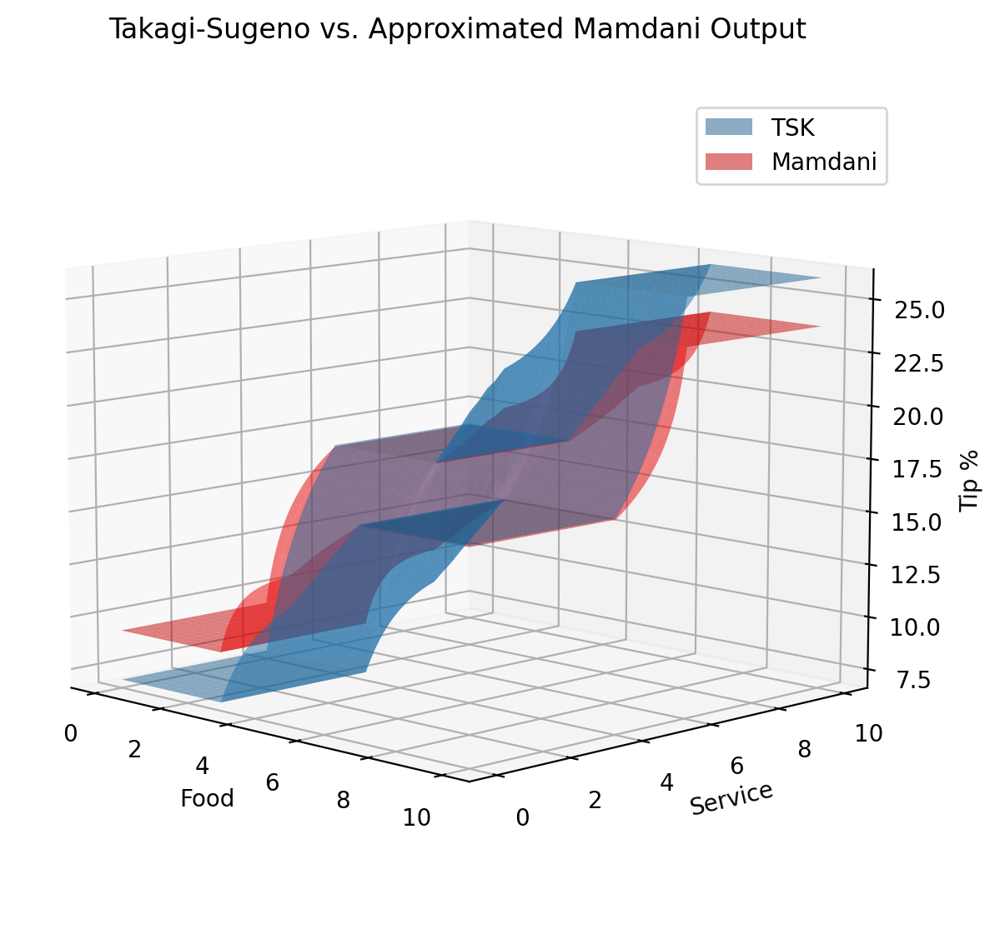

Example: Approximation of Mamdani
=================================

.. code-block:: python

    # Import hotfis
    import hotfis as hf

    # Other imports
    import numpy as np
    import matplotlib.pyplot as plt
    from itertools import product

    # Define membership function groupset
    groupset = hf.FuzzyGroupset([
        # Input group 1
        hf.FuzzyGroup("service", 0, 10, [
            hf.FuzzyFunc("poor", [3, 5], "leftedge"),
            hf.FuzzyFunc("good", [3, 5, 7], "triangular"),
            hf.FuzzyFunc("excellent", [5, 7], "rightedge")
        ]),

        # Input group 2
        hf.FuzzyGroup("food", 0, 10, [
            hf.FuzzyFunc("rancid", [4, 6], "leftedge"),
            hf.FuzzyFunc("delicious", [4, 6], "rightedge")
        ]),

        # Output group with zeroth order TSK outputs as parameters
        hf.FuzzyGroup("tip", 0, 30, [
            hf.FuzzyFunc("cheap", [7], "tsk"),
            hf.FuzzyFunc("average", [17], "tsk"),
            hf.FuzzyFunc("generous", [26], "tsk")
        ]),
    ])

    # Create a ruleset
    ruleset = hf.FuzzyRuleset([
        "if service is poor or food is rancid then tip is cheap",
        "if service is good then tip is average",
        "if service is excellent or food is delicious then tip is generous",
    ])

    # Create the FIS
    fis = hf.FIS(groupset, ruleset)

    # Create new FIS with approximated Mamdani outputs functions
    approx_fis = fis.approximate_mamdani()

|pic1|  |pic2|

.. code-block:: python

    # ----------
    # Evaluation
    # ----------

    # Choose number of points to evaluate for each antecedent input
    num_points = 201

    # Save input values
    foods = np.linspace(0, 10, num_points)
    services = foods.copy()

    # Get all combinations of inputs
    combos = np.array(list(product(foods, services)))
    inputs = {"food": combos[:, 0], "service": combos[:, 1]}

    # Calc tsk outputs
    tips_tsk = fis.eval_tsk(inputs)["tip"].reshape(num_points, num_points)

    # Calc mamdani outputs
    tips_mam = approx_fis.eval_mamdani(inputs)["tip"]
    tips_mam = approx_fis.defuzz_mamdani(tips_mam)
    tips_mam = tips_mam.reshape(num_points, num_points)

    # Convert inputs to grids for 3D visualization
    foods, services = np.meshgrid(foods, services)

    # ----
    # Plot
    # ----

    fig = plt.figure(figsize=(7, 7), dpi=200)
    ax = fig.gca(projection='3d')

    p1 = ax.plot_surface(foods, services, tips_tsk, alpha=0.5, label="TSK")
    p2 = ax.plot_surface(foods, services, tips_mam, alpha=0.5, label="Mamdani", color="red")

    ax.view_init(elev=10, azim=-45)

    ax.set_xlabel("Food")
    ax.set_ylabel("Service")
    ax.set_zlabel("Tip %")

    ax.set_title("Takagi-Sugeno vs. Approximated Mamdani Output")

    p1._facecolors2d = p1._facecolor3d
    p1._edgecolors2d = p1._edgecolor3d
    p2._facecolors2d = p2._facecolor3d
    p2._edgecolors2d = p2._edgecolor3d
    ax.legend(loc="best", bbox_to_anchor=(1, 0.95))

    plt.show()

