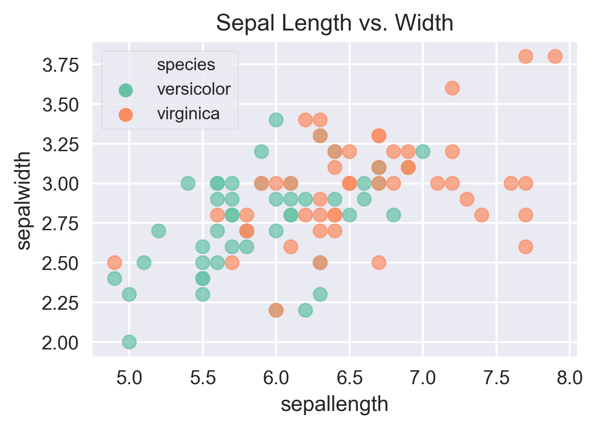
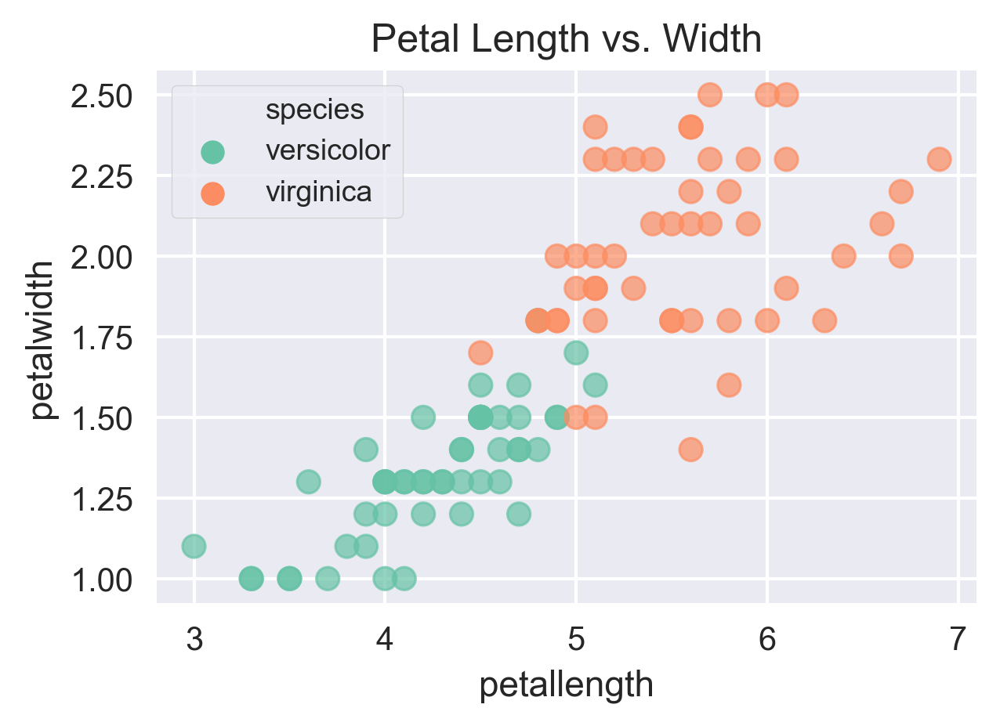
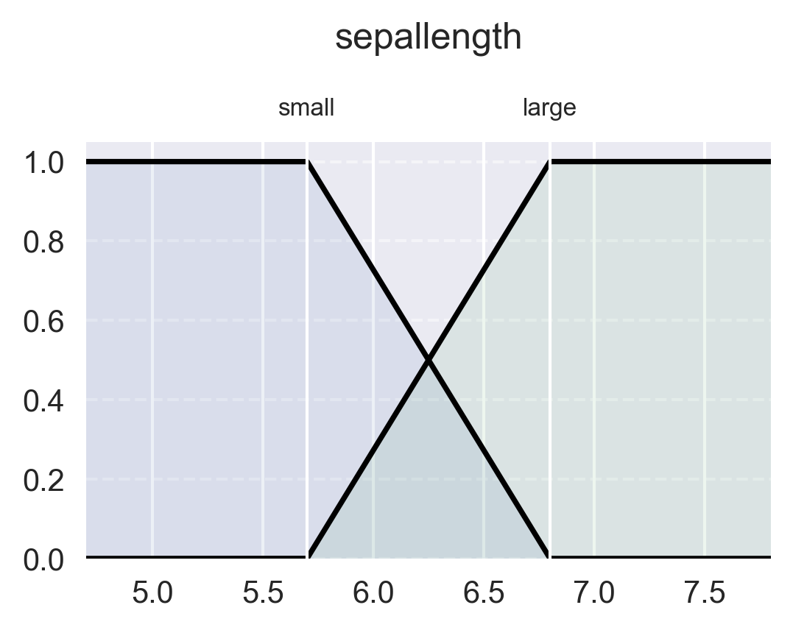

Example: Iris
=============

The following is an example of binary classification with a FIS. The goal is to
differentiate the versicolor species from the virginica species in the
iris dataset. However, this example is more for illustrating TSK
evaluation of vectorized input and Pandas compatability. Consequently, the
membership functions and ruleset are very simple.

.. code-block:: python

    # -----
    # Setup
    # -----

    # Import Hotfis
    import hotfis as hf

    # Other imports and prep
    import numpy as np
    import pandas as pd
    from sklearn.datasets import load_iris
    import matplotlib.pyplot as plt
    import seaborn as sns
    plt.style.use("seaborn")

    # Load data
    data = load_iris()

    # Change column names, create Pandas DataFrame
    iris = ...

    # Remove setosa
    iris = iris[iris["species"] != "setosa"]

    display(iris)

.. list-table::
   :widths: 25 25 25 25 25
   :header-rows: 1

   * - sepallength
     - sepalwidth
     - petallength
     - petalwidth
     - species
   * - 7.0
     - 3.2
     - 4.7
     - 1.4
     - versicolor
   * - ...
     - ...
     - ...
     - ...
     - ...

.. code-block:: python

    # ------------------
    # Data Visualization
    # ------------------

    # Plot sepal and sepal length vs width
    sns.scatterplot(...)
    plt.show()

|pic1|  |pic2|

.. code-block:: python

    # ------------
    # FIS Creation
    # ------------

    # Define membership function groupset
    groupset = hf.FuzzyGroupset([
        # Sepal length
        hf.FuzzyGroup("sepallength", 4.7, 7.8, [
            hf.FuzzyFunc("small", [5.7, 6.8], "leftedge"),
            hf.FuzzyFunc("large", [5.7, 6.8], "rightedge")
        ]),

        # Sepal width
        hf.FuzzyGroup("sepalwidth", 1.8, 3.8, [
            hf.FuzzyFunc("small", [2.3, 3.2], "leftedge"),
            hf.FuzzyFunc("large", [2.5, 3.3], "rightedge")
        ]),

        # Petal length
        hf.FuzzyGroup("petallength", 4.0, 5.9, [
            hf.FuzzyFunc("small", [4.8, 5.1], "leftedge"),
            hf.FuzzyFunc("large", [4.8, 5.0], "rightedge")
        ]),

        # Petal width
        hf.FuzzyGroup("petalwidth", 1.2, 2.1, [
            hf.FuzzyFunc("small", [1.6, 1.7], "leftedge"),
            hf.FuzzyFunc("large", [1.5, 1.7], "rightedge")
        ]),

        # Output
        hf.FuzzyGroup("virginica", -1.0, 1.0, [
            hf.FuzzyFunc("unlikely", [-1.0], "tsk"),
            hf.FuzzyFunc("likely", [1.0], "tsk")
        ]),
    ])

|pic3|  |pic4|

.. |pic4| image:: ../../_static/iris/swidth.png
   :width: 48%

|pic5|  |pic6|

.. |pic6| image:: ../../_static/iris/pwidth.png
   :width: 48%

.. code-block:: python

    # Define the fuzzy ruleset using group and function names from above
    ruleset = hf.FuzzyRuleset([
        hf.FuzzyRule("if sepallength is small then virginica is unlikely"),
        hf.FuzzyRule("if sepallength is large then virginica is likely"),

        hf.FuzzyRule("if sepalwidth is small then virginica is unlikely"),
        hf.FuzzyRule("if sepalwidth is large then virginica is likely"),

        hf.FuzzyRule("if petallength is small then virginica is unlikely"),
        hf.FuzzyRule("if petallength is large then virginica is likely"),

        hf.FuzzyRule("if petalwidth is small then virginica is unlikely"),
        hf.FuzzyRule("if petalwidth is large then virginica is likely"),
    ])

    # Create the fuzzy inference system
    fis = hf.FIS(groupset, ruleset)

.. code-block:: python

    # ----------
    # Evaluation
    # ----------

    # Evaluate FIS for each iris
    iris["is_virginica"] = fis.eval_tsk(iris)["virginica"]

    # Convert from [-1, 1] to [0, 1] and create negated column for versicolor
    iris["is_virginica"] = (iris["is_virginica"] + 1) / 2
    iris["is_versicolor"] = -iris["is_virginica"] + 1

    # Save name of more likely class and compute accuracy
    iris["prediction"] = np.round(iris["is_virginica"]).astype("int")
    iris["prediction"] = iris["prediction"].map({0: "versicolor", 1: "virginica"})
    accuracy = np.sum(iris["species"] == iris["prediction"]) / iris.shape[0]

    # Sum of TSK output for correct class
    score = (np.sum(iris[iris["species"] == "versicolor"]["is_versicolor"]) +
             np.sum(iris[iris["species"] == "virginica"]["is_virginica"]))
    score /= iris.shape[0]

    # Display last four rows
    results = iris.loc[:, 4:]

    # Show results
    display(results)
    print(f"Accuracy                        : {accuracy:.2f}")
    print(f"Sum of output for correct class : {score:.4f}")

.. list-table::
   :widths: 25 25 25 25
   :header-rows: 1

   * - species
     - is_virginica
     - is_versicolor
     - prediction
   * - versicolor
     - 0.483871
     - 0.516129
     - versicolor
   * - versicolor
     - 0.390029
     - 0.609971
     - versicolor
   * - versicolor
     - 0.558621
     - 0.441379
     - virginica
   * - ...
     - ...
     - ...
     - ...

**Outputs**::

    Accuracy                        : 0.90
    Sum of output for correct class : 0.7912

