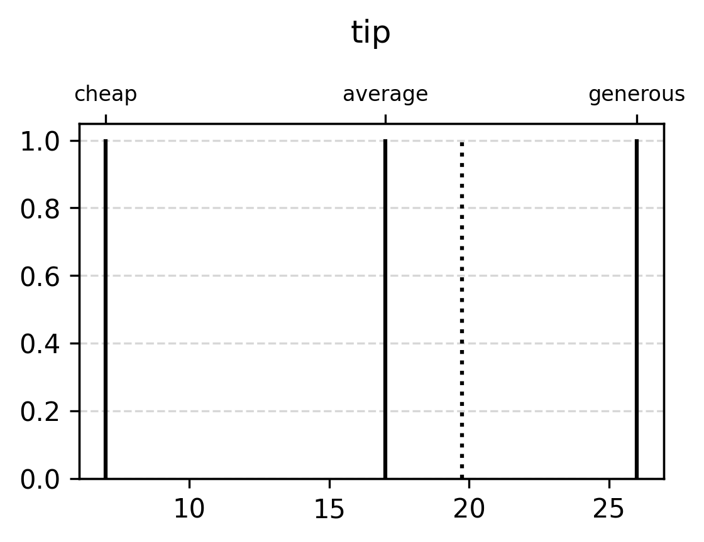

Example: Takagi-Sugeno
======================

The following is an example of Takagi-Sugeno inference with the commonly
employed tipping example. Unlike the simpler temperature example, there
are multiple input membership function groups and multiple rule antecedents.

A fuzzy inference system (FIS) is created, input values are stored in a
mapping data structure such as a dictionary, and evaluation is performed.
Unlike Mamdani inference, outputs are implicitly defuzzified.

.. code-block:: python

    # Imports
    import hotfis as hf
    import matplotlib.pyplot as plt  # For plotting functionality

    # --------------
    # FIS Definition
    # --------------

    # Define membership function groupset
    groupset = hf.FuzzyGroupset([
        # Input group 1
        hf.FuzzyGroup("service", 0, 10, [
            hf.FuzzyFunc("poor", [3, 5], "leftedge"),
            hf.FuzzyFunc("good", [3, 5, 7], "triangular"),
            hf.FuzzyFunc("excellent", [5, 7], "rightedge")
        ]),

        # Input group 2
        hf.FuzzyGroup("food", 0, 10, [
            hf.FuzzyFunc("rancid", [4, 6], "leftedge"),
            hf.FuzzyFunc("delicious", [4, 6], "rightedge")
        ]),

        # Output group with zeroth order TSK outputs as parameters
        hf.FuzzyGroup("tip", 0, 30, [
            hf.FuzzyFunc("cheap", [7], "tsk"),
            hf.FuzzyFunc("average", [17], "tsk"),
            hf.FuzzyFunc("generous", [26], "tsk")
        ]),
    ])

    # Define the fuzzy ruleset using group and function names from above
    ruleset = hf.FuzzyRuleset([
        "if service is poor or food is rancid then tip is cheap",
        "if service is good then tip is average",
        "if service is excellent or food is delicious then tip is generous",
    ])

    # Create the fuzzy inference system
    fis = hf.FIS(groupset, ruleset)

    # --------------
    # FIS Evaluation
    # --------------

    # Inputs must map the input group names as strings to scalar or array-like inputs
    # Dictionary and Pandas DataFrames are examples of valid input formats
    inputs = {"service": 4.3, "food": 6.5}

    # Get dictionary of outputs for each group
    all_outputs = fis.eval_tsk(inputs)

    # Get output tuple with domain and codomain for heater group
    tip_output = all_outputs["tip"]

    # Print input and output
    print(f"Service : ({inputs['service']})")
    print(f"Food    : ({inputs['food']})")
    print(f"--> Tip ({tip_outputs})")

    # Plot both group and output
    fis.groupset["tip"].plot()
    fis.plot_tsk(tip_output)
    plt.show()

**Outputs**::

    Service : (4.3)
    Food    : (6.5)
    --> Tip (19.75)

