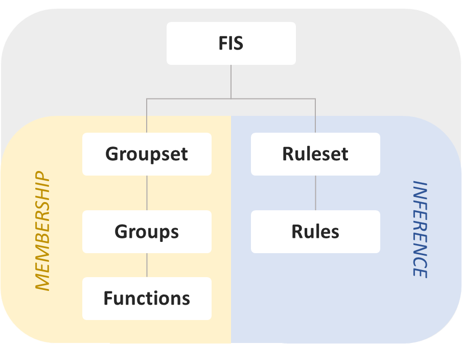

Guide: FIS
==========

.. contents::

Overview
--------

A fuzzy inference system (FIS) is the fundamental object in HotFIS. They hold
the definitions of fuzzy sets and rules used in both Mamdani and Takagi-Sugeno
inference.

The structure of the FIS is as follows:

Membership
----------

Membership functions compute the degree to which an input belongs to a
fuzzy sets. These functions are grouped together as the first of two components
that comprise a FIS.

FuzzyFunc
^^^^^^^^^

HotFIS is built upon functions that compute an input's degree of membership
to implicitly defined fuzzy sets. They are instantiated with a name, list of
parameters, and how input should be used to calculate membership.

See :doc:`func_templates` for more info on instantiation.

Example:

.. code-block:: python

    fn = FuzzyFunc("hot", [-1, 0, 1], "triangular")

    fn.plot(-2, 2)
    plt.show()

.. image:: ../../_static/fuzzyfuncs/triangular.png
  :width: 380

FuzzyGroup
^^^^^^^^^^

Multiple membership functions are stored in named groups that save domain
limits for Mamdani evaluation and visualization.

Example:

.. code-block:: python

    group = FuzzyGroup("temperature", 0, 100, [
        FuzzyFunc("cold", [30, 40], "leftedge"),
        FuzzyFunc("warm", [30, 40, 60, 70], "trapezoidal"),
        FuzzyFunc("hot", [60, 70], "rightedge")
    ])

    group.plot()
    plt.show()

.. image:: ../../_static/group_ex.png
  :width: 450

FuzzyGroupset
^^^^^^^^^^^^^

Membership function groupsets form one of the two main components of a
FIS. They maintain multiple function groups for easy evaluation.

Example:

.. code-block:: python

    groupset = FuzzyGroupset([
        FuzzyGroup("temperature", 0, 100, [
            FuzzyFunc("cold", [30, 40], "leftedge"),
            FuzzyFunc("warm", [30, 40, 60, 70], "trapezoidal"),
            FuzzyFunc("hot", [60, 70], "rightedge")
        ]),

        FuzzyGroup("heater", 0.0, 1.0, [
            FuzzyFunc("off", [0.1, 0.2], "leftedge"),
            FuzzyFunc("medium", [0.1, 0.2, 0.8, 0.9], "trapezoidal"),
            FuzzyFunc("on", [0.8, 0.9], "rightedge")
        ]),
    ])

Inference
---------

The other component of a FIS is a ruleset. Fuzzy rules determine membership of
inputs to the function groupset's output functions.

FuzzyRule
^^^^^^^^^

Fuzzy rules are parsed from English using the names of membership functions
and membership function groups. They can evaluate input to determine output.

Multiple antecedents connected by 'and' and 'or' operators are supported.

Example:

.. code-block:: python

    rule = FuzzyRule("if temperature is hot then heater is off")

FuzzyRuleset
^^^^^^^^^^^^

Fuzzy rulesets act as a container of fuzzy rules and the second major component
of a FIS.

Example:

.. code-block:: python

    ruleset = FuzzyRuleset([
        FuzzyRule("if temperature is cold then heater is on"),
        FuzzyRule("if temperature is warm then heater is medium"),
        FuzzyRule("if temperature is hot then heater is off")
    ])

FIS
---

Once both a groupset and ruleset are defined the FIS can be created.

.. code-block:: python

    fis = FIS(groupset, ruleset)

After creating a FIS, components can be retrieved and manipulated.

.. code-block:: python

    hot_fn = fis.groupset["temperature"]["hot"]

Input can be also be evaluated for memberships, fuzzified Mamdani output,
and TSK output. See examples like :doc:`../examples/mamdani` and
:doc:`../examples/takagi-sugeno` for basic illustrations of evaluation,
defuzzification, and visualization.

.. code-block:: python

    # Evaluation
    membership_output = fis.eval_membership(vals)
    mamdani_output = fis.eval_mamdani(vals)
    tsk_output = fis.eval_tsk(vals)
